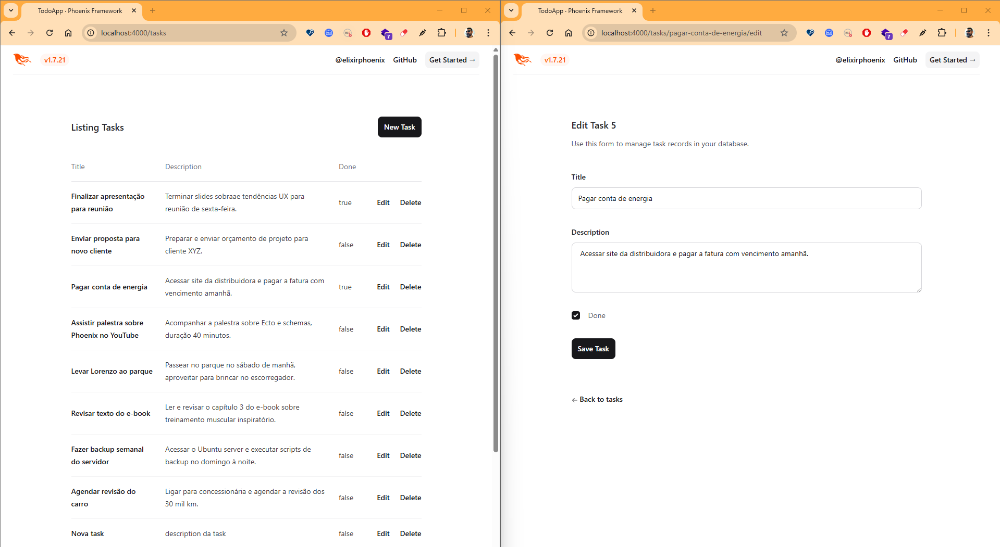

# 🔥 Projeto 1: To-do List Simples com Phoenix

Um CRUD completo para gerenciar tarefas, desenvolvido com [Elixir Phoenix](https://phoenixframework.org/).
Este projeto faz parte do desafio de 10 projetos para aprendizado de Phoenix/Elixir.

---

## 🚀 Funcionalidades

* Adicionar, editar, excluir e listar tarefas
* Cada tarefa possui título, descrição (com suporte a textos longos) e status de conclusão
* URLs amigáveis usando slugs no lugar do ID (ex: `/tasks/comprar-ingredientes-para-o-jantar`)
* Validação de formulário e feedback visual
* Front-end pronto para customização com TailwindCSS

---

## 🖼️ Demonstração




---

## ⚙️ Tecnologias utilizadas

* [Elixir](https://elixir-lang.org/)
* [Phoenix Framework](https://phoenixframework.org/)
* [Ecto](https://hexdocs.pm/ecto/Ecto.html)
* [SQLite](https://www.sqlite.org/index.html) (padrão, mas fácil trocar para Postgres)
* [TailwindCSS](https://tailwindcss.com/) (pré-configurado)

---

## 🏗️ Como rodar o projeto

### 1. **Clone o repositório**

```bash
git clone https://github.com/felipegenuino/phoenix_projects.git
cd phoenix_projects/todo_app/
```

### 2. **Instale as dependências**

```bash
mix deps.get
cd assets && npm install && cd ..
```

### 3. **Crie e migre o banco de dados**

```bash
mix ecto.setup
```

### 4. **Execute o servidor Phoenix**

```bash
mix phx.server
```

Acesse em [http://localhost:4000/tasks](http://localhost:4000/tasks)

---

## 🔄 Usando Postgres (opcional)

Para usar o [PostgreSQL](https://www.postgresql.org/) ao invés de SQLite:

* Altere o parâmetro `--database postgres` ao criar o projeto com `mix phx.new`.
* Ou atualize as configurações em `config/dev.exs` e `config/test.exs`.
* Rode `mix ecto.setup` normalmente.

---

## ✨ Estrutura do projeto

* **lib/todo\_app/tasks/task.ex** — schema Ecto para as tasks
* **lib/todo\_app\_web/controllers/task\_controller.ex** — controller principal do CRUD
* **lib/todo\_app\_web/controllers/task\_html/** — templates (HEEx) para views e formulários
* **priv/repo/migrations/** — migrações de banco de dados

---

## 📚 Aprendizados e tópicos explorados

* Geradores do Phoenix (`phx.gen.html`)
* Customização de rotas e URLs com slug
* Validação de forms e tratamento de erros
* Organização MVC do Phoenix

---

## 🚦 Próximos passos sugeridos

* Adicionar autenticação de usuários
* Melhorar a interface visual com componentes customizados
* Implementar testes automatizados

---

## 📄 Licença

MIT

---

## 🤝 Contribuições

Pull Requests são bem-vindos!
Sinta-se à vontade para abrir issues ou sugerir melhorias.

---

**Projeto desenvolvido por [Felipe Genuino](https://github.com/felipegenuino) como parte do desafio de 10 projetos Phoenix.**
